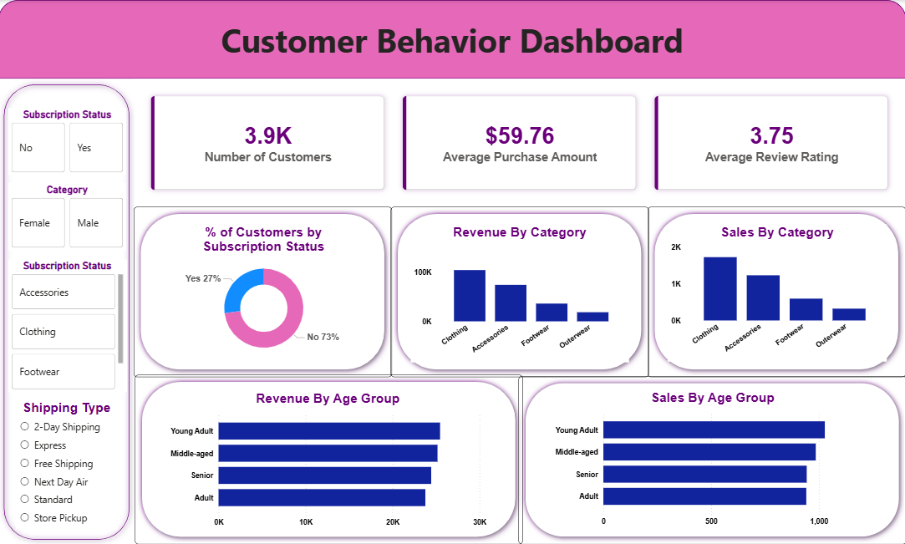

# 🛍️ Customer Shopping Behavior Analysis



---

# 📌 Project Overview

This project analyses customer shopping behaviour using transactional retail data to uncover meaningful insights into customer spending patterns, subscription behaviour, product performance, and purchase trends.

The project follows a complete end-to-end data analytics workflow using:

🐍 Python → Data Cleaning & Feature Engineering  
🛢️ SQL → Business Analysis  
📊 Power BI → Interactive Dashboard Development  

The objective was to help a retail business better understand customer behaviour and make data-driven business decisions.

---

# 🎯 Business Problem

A retail company wanted to analyse customer shopping patterns to improve:

- Customer engagement
- Product strategy
- Loyalty programmes
- Subscription conversion
- Revenue growth

The goal was to identify the factors influencing customer purchases and optimise business strategies accordingly.

---

# 🧰 Tech Stack

| Technology | Usage |
|---|---|
| Python | Data Cleaning & Analysis |
| Pandas | Data Manipulation |
| NumPy | Numerical Operations |
| SQL | Business Analysis |
| PostgreSQL / MySQL | Database Management |
| Power BI | Dashboard & Visualisation |

---

# 📂 Dataset Information

- 📄 Total Records: 3,900
- 📊 Total Columns: 18

### 🔑 Key Features
- Customer demographics
- Product categories
- Purchase amount
- Review ratings
- Subscription status
- Shipping preferences
- Discount usage
- Purchase frequency

---

# ⚙️ Project Workflow

## 🐍 1. Data Cleaning & Preparation (Python)

Performed:
- ✅ Missing value handling
- ✅ Column standardisation
- ✅ Feature engineering
- ✅ Data consistency checks
- ✅ Customer segmentation preparation
- ✅ Age group creation
- ✅ Purchase frequency analysis

### 📌 Key Python Tasks
- Handled missing values in review ratings
- Converted column names into snake_case
- Created age group categories
- Removed redundant columns
- Connected cleaned data to SQL database

---

## 🛢️ 2. Business Analysis Using SQL

Solved multiple business-driven analytical problems including:

### 💰 Revenue Analysis
- Revenue by gender
- Revenue by age group
- Revenue by category

### 👥 Customer Behaviour Analysis
- Repeat buyers analysis
- Subscription behaviour
- Customer segmentation

### 🛍️ Product Performance Analysis
- Top-rated products
- Most purchased products
- Discount dependency analysis

### 🚚 Shipping & Discount Insights
- Shipping type comparison
- Discount impact on purchases

---

# 📌 SQL Business Questions Solved

1️⃣ Revenue generated by male vs female customers  
2️⃣ High-spending customers using discounts  
3️⃣ Top 5 products with highest review ratings  
4️⃣ Standard vs Express shipping comparison  
5️⃣ Subscriber vs Non-subscriber revenue analysis  
6️⃣ Products with highest discount dependency  
7️⃣ Customer segmentation analysis  
8️⃣ Top purchased products by category  
9️⃣ Repeat buyers subscription analysis  
🔟 Revenue contribution by age group  

---

# 📊 Power BI Dashboard

Built an interactive Power BI dashboard to visualise:

- KPI Metrics
- Revenue Insights
- Product Performance
- Customer Demographics
- Subscription Behaviour
- Sales Trends

### ✨ Dashboard Features
- KPI Cards
- Interactive Slicers
- Donut Charts
- Bar Charts
- Revenue Analysis
- Customer Segmentation Insights

---

# 🔍 Key Insights

📌 Male customers generated higher overall revenue.  
📌 Clothing category contributed the highest sales.  
📌 Young adults generated the highest revenue contribution.  
📌 Loyal customers formed the majority customer segment.  
📌 Subscription users showed strong repeat purchase behaviour.  
📌 Discounts significantly influenced product purchases.  

---

# 💡 Business Recommendations

✅ Promote subscription-based customer benefits  
✅ Improve customer loyalty programmes  
✅ Optimise discount strategies  
✅ Focus marketing campaigns on high-value customer groups  
✅ Highlight top-performing products in campaigns  

---

# 🗂️ Repository Structure

```bash
customer-shopping-behavior-analysis/
│
├── customer_behavior_analysis.ipynb
├── customer_behavior_analysis.sql
├── customer_behavior_analysis.pbix
├── customer_shopping_behavior.csv
├── Customer Shopping Behavior Analysis.pdf
├── Business Problem Document.pdf
├── dashboard_preview.png
└── README.md
```

---

# 📁 Files Included

| File | Description |
|---|---|
| customer_behavior_analysis.ipynb | Python notebook for data cleaning and preparation |
| customer_behavior_analysis.sql | SQL queries for business analysis |
| customer_behavior_analysis.pbix | Interactive Power BI dashboard |
| customer_shopping_behavior.csv | Dataset used for analysis |
| Customer Shopping Behavior Analysis.pdf | Final project report |
| Business Problem Document.pdf | Original business problem statement |

---

# 🚀 Skills Demonstrated

✔️ Data Cleaning  
✔️ Exploratory Data Analysis  
✔️ Feature Engineering  
✔️ SQL Querying  
✔️ Business Analysis  
✔️ Dashboard Development  
✔️ Data Visualisation  
✔️ Business Intelligence  

---

# 🏁 Conclusion

This project demonstrates a complete end-to-end retail customer analytics workflow using Python, SQL, and Power BI.

The analysis helps businesses better understand customer purchasing behaviour and supports data-driven strategic decision-making.

---

# 👨‍💻 Author

## Sourav Mukherjee

📧 Email: mukherjeesourav687@gmail.com  

### 🌐 Connect With Me

- 🔗 LinkedIn: https://www.linkedin.com/in/sourav-mukherjee-03566a296
- 💻 GitHub: https://github.com/mukherjeesourav687
- ✍️ Medium: https://medium.com/@mukherjeesourav687

---

# ⭐ If you liked this project

Give this repository a ⭐ on GitHub!
